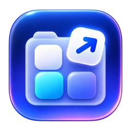

# Nest Launcher

[简体中文](README.md) | **English**



**A home for every app. A shortcut to your everyday tools.**

Nest Launcher is a native macOS app organizer and quick launcher. Organize apps into categories for work, development, design, entertainment, or any workflow, then access them through the main window, a global shortcut, the menu bar, or a floating desktop icon.

The source code, icon assets, build scripts, and tests for the current version are fully available. No account is required. Your data stays on your Mac, and the app does not depend on an online service.

## Features

### App organization

- Create custom categories with nested subcategories.
- Drag apps from Finder, the Dock, or the app library into a category.
- Scan system and user application folders, including ordinary subfolders, without traversing app bundles.
- Refresh the app library independently; scanning does not automatically add every app to your categories.
- Edit names, keywords, notes, and favorites.
- Select multiple items in list view to launch, favorite, move, or remove them together.

Removing a launcher item only deletes its record in Nest Launcher. It does not uninstall or delete the app from your Mac.

### Search and launch

- Double-click an app or launch it from its context menu.
- Search by name, path, keywords, or notes.
- Sort by name, launch count, or most recently used.
- Record successful launches and show an error if an app cannot be opened.
- Use `Option + Space` to show or hide the main window. Change the shortcut in Settings.

### Menu bar and floating launcher

- Keep running in the background after closing the main window.
- Optionally launch at login using the native macOS login-item mechanism; off by default.
- Click the menu bar icon to toggle the main window. Right-click for Settings or Quit.
- Drag the circular floating icon to a screen edge; its position is remembered.
- The icon rests half-hidden and animates into view on hover.
- A black docking background blends into the screen edge. Hide the floating icon from Settings or its context menu.

### Native appearance and controls

- Frosted-glass window background and rounded components.
- Native glass components on macOS 26 and later, with a fallback appearance on earlier systems.
- Compact Light / System / Dark appearance selector.
- Simplified Chinese and English interface, with a System language option. Switching takes effect immediately without changing your custom names or notes.
- List and grid layouts for launcher items and the app library.
- Adjustable icon size and grid spacing.
- Optional two-finger horizontal trackpad gestures to switch categories.

### Local data and backups

- Store categories, launcher items, and usage records in a local JSON file.
- Automatically retain the previous valid data file; export data or restore from a backup or JSON file.
- Preserve the current file before restoring, so you can undo a restore.
- Preserve unreadable data and stop overwriting it until the problem is resolved.
- Scan, encode, and save on background queues; wait for pending saves during a normal quit.
- No continuous application-folder polling, account login, telemetry, or data-upload logic.

## Download and install

**Requires macOS 14 or later.**

Universal builds include Apple Silicon (`arm64`) and Intel (`x86_64`). The Intel build has been compiled but has not been tested on physical Intel hardware.

1. Download the latest `.dmg` from this repository's **Releases** page.
2. Open the DMG and drag **Nest Launcher.app** into **Applications**.
3. Open Nest Launcher from Applications.

### First-launch security warning

Current packages are ad-hoc signed, without Apple Developer ID signing or notarization. macOS may block the first launch after a browser download.

First confirm that the package came from this project's trusted release page. Then follow the macOS instructions in **System Settings → Privacy & Security** to allow it to open. You do not need to disable macOS security protections.

## Getting started

1. The **All Apps** panel is expanded by default on first launch.
2. Create categories such as Development, Work, or Design on the left.
3. Drag apps from the app library or Finder into a category.
4. Double-click an app to launch it; use `Option + Space` to toggle the main window.
5. Open Settings to change the interface language, login behavior, shortcut, floating icon, or gestures, or to export a backup.

| Action | Shortcut or control |
| --- | --- |
| Show / hide main window | `Option + Space`, customizable |
| Open Settings | `Command + ,` |
| New launcher item | `Command + N` |
| New category | `Command + Shift + D` |
| Quit completely | `Command + Q`, or Quit in a context menu |

Closing the main window does not quit the app. To start it automatically after logging in, install it in Applications and enable **Launch Nest Launcher at login** in Settings. It starts after login, not before. If approval is required, allow it in **System Settings → General → Login Items**. Changes made there are refreshed when you return to the app.

The **Shortcut note** on an individual item is informational only and does not register a shortcut to launch that app. The global show/hide shortcut is configured in Settings.

## Data location

Default data file:

```text
~/Library/Application Support/NestLauncher/data.json
```

The app is named **Nest Launcher**; internal modules and the data folder use `NestLauncher`. If upgrading from an older version that used a different data folder, export data in the old version and restore it in the new one. Preferences are stored separately for those versions.

- `data.json.backup`: the previous valid file, updated on subsequent saves.
- `data.json.before-restore-<identifier>.json`: the file preserved before a restore.

Exports contain categories, launcher items, and usage records, not language, appearance, shortcuts, login-item settings, or the floating icon's position. For long-term backups, use **Export Data** rather than relying only on the previous automatic backup. Force-quitting may interrupt pending saves.

## Build from source

The project uses Swift, SwiftUI, AppKit, and Swift Package Manager. Building requires macOS and a full Xcode installation with the SDK needed to compile the native glass components.

Run these commands from the repository root:

```bash
# Development build for the current Mac
bash ./make-app.sh debug
open "dist/Nest Launcher.app"

# Universal release build: Apple Silicon + Intel
bash ./make-app.sh release universal

# Create a Universal DMG
bash ./make-dmg.sh universal
```

The app is created at `dist/Nest Launcher.app`. Installers are named `Nest-Launcher-<version>-universal.dmg`. You can also build for `native`, `arm64`, or `x86_64`. The DMG script will not overwrite an existing installer with the same name; move the old file aside first.

### Tests

```bash
DEVELOPER_DIR=/Applications/Xcode.app/Contents/Developer /Applications/Xcode.app/Contents/Developer/Toolchains/XcodeDefault.xctoolchain/usr/bin/swift test \
  -Xswiftc -load-plugin-library \
  -Xswiftc /Applications/Xcode.app/Contents/Developer/Platforms/MacOSX.platform/Developer/usr/lib/swift/host/plugins/libSwiftUIMacros.dylib
```

Tests use isolated temporary data to cover data protection, category cycles, batch imports, drag-and-drop result merging, selection cleanup, launch failures, category caching, nested-folder scanning, and backup restoration. Login-item tests use a fake service without modifying real login items. Localization tests check translations, format arguments, preference persistence, and system-language resolution without changing your actual settings.

## Open source and contributions

The current version's source code, assets, and build process are fully available, with no closed-source business modules. **Issues** and **Pull Requests** are welcome.

When reporting a problem, include your macOS version, app version, chip architecture, steps to reproduce, and relevant screenshots. Hide personal paths or other sensitive information.

Do not publish personal data backups. `Backups/`, `.build/`, and `dist/` are excluded by `.gitignore`; upload installers separately to GitHub Releases.

## License

The current open-source version is licensed under the [MIT License](LICENSE). Copyright (c) 2026 ckhaha.

Commercial use, modification, and redistribution, including use in closed-source software, are permitted provided the copyright and license notices are retained. The software is provided as-is, without warranty. Future versions are governed by the license included with that version.
